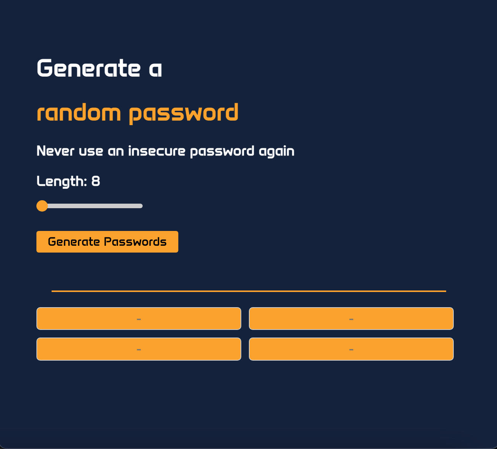

# Scrimba - Random password generator solution

This is a solution to the [Random password generator project on Scrimba](https://scrimba.com/learn/learnjavascript/). Scrimba helps you improve your coding skills by building realistic projects.

## Table of contents

- [Overview](#overview)
  - [The challenge](#the-challenge)
  - [Screenshot](#screenshot)
  - [Links](#links)
- [My process](#my-process)
  - [Built with](#built-with)
  - [What I learned](#what-i-learned)
  - [Continued development](#continued-development)
  - [Useful resources](#useful-resources)
- [Author](#author)

## Overview

### The challenge

Users should be able to:

- Generate 4 passwords by 8-12 characters clicking on the button
- Set the password length by slider
- See passwords' length in real time
- Copy passwords to the clipboard clicking on the them

### Screenshot



### Links

- Solution URL: [@GitHub](https://github.com/razaali90/password_generator)
- Live Site URL: [@GitHub](https://htmlpreview.github.io/?https://github.com/razaali90/password_generator/blob/main/index.html)

## Process

### Built with

- Semantic HTML5 markup
- CSS custom properties
- Flexbox
- Vanilla Javascript

### What I learned

This project helped me learn important concepts of HTML, CSS and vanilla JS, I specifically learnt:

- To create a responsive design using flexbox made up of 2 columns and 2 rows of the same dimensions

```css
.textbox-container {
    display: flex;
    flex-direction: column;
    text-align: center;
}

.textbox-row {
    display: flex;
    margin-bottom: 10px; /* Adjust margin between rows */
}
```

- To generate multiple random passwords and render them on HTML via Javascript

```js
function displayPassword() {
    const generatedPasswordOne = generateRandomPassword()
    const generatedPasswordTwo = generateRandomPassword()
    const generatedPasswordThree = generateRandomPassword()
    const generatedPasswordFour = generateRandomPassword()
    password1El.value = generatedPasswordOne
    password2El.value = generatedPasswordTwo
    password3El.value = generatedPasswordThree
    password4El.value = generatedPasswordFour
}
```

### Continued development

I'd like to:

- ~~Implement the ability to set the password length~~
- ~~Add 1-click copy password to the clipboard~~

### Useful resources

- [Emanuele Del Monte](https://github.com/xdelmo/random-password-generator) - Big shout out to the developer, used screenshot provided to style my own passsword generator and especially used README.md file to write my own 
- [Custom Slider](https://blog.logrocket.com/creating-custom-css-range-slider-javascript-upgrades/) - This helped me to understand how to style the slider using CSS and JS
- [ChatGPT](https://chat.openai.com/) - Used it to query regarding blockers while developing the whole project

## Author

- GitHub - [Raza Ali](https://github.com/razaali90)
